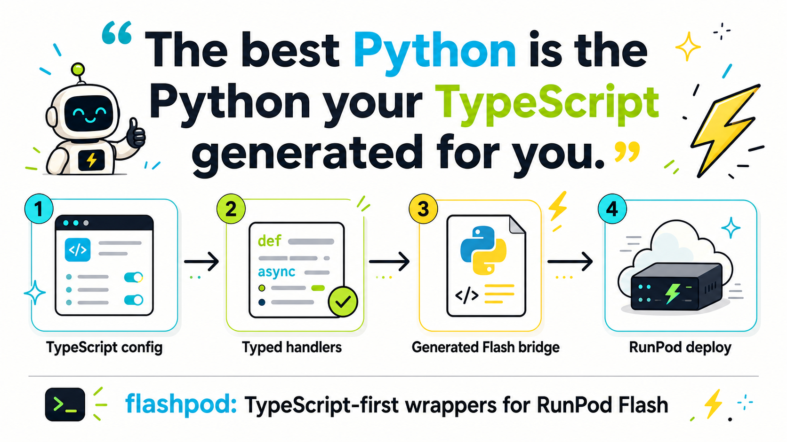

# flashpod

[](https://github.com/reachjalil/flashpod/actions/workflows/ci.yml)
[](https://www.npmjs.com/package/flashpod)
[](LICENSE)
[](package.json)

TypeScript-first wrapper for [RunPod Flash](https://github.com/runpod/flash).



`flashpod` lets you define Flash endpoints in TypeScript, generate the tiny
Python bridge that the official Flash builder expects, and then call
`flash dev`, `flash build`, or `flash deploy` from the same CLI.

`flashpod` is community-maintained and is not an official RunPod package.

## What works now

- Typed endpoint config in `flashpod.config.ts`
- Generated `flash_app.py` bridge for queue and load-balanced endpoints
- CLI lifecycle wrapper around the official `flash` command
- TypeScript client for RunPod queue and load-balanced endpoint calls
- npm-ready package named `flashpod`
- Unit, CLI e2e, package-smoke, and generated Python bridge tests

## Install

```bash
npm install flashpod
uv tool install runpod-flash
```

Flash still needs its official Python CLI installed locally because this first
version delegates deployment to `runpod-flash`.

Requirements:

- Node.js 20.11 or newer
- Python with the official `runpod-flash` CLI available as `flash`
- A RunPod API key for deploys and endpoint calls

## Getting Started With npx

You can try `flashpod` in any TypeScript project without installing it globally:

```bash
npm install flashpod
uv tool install runpod-flash
npx flashpod doctor
```

Create the starter config:

```bash
npx flashpod init
```

That writes `flashpod.config.ts`:

```ts
import { CpuInstanceType, defineConfig, endpoint, handler } from "flashpod";

export default defineConfig({
  app: "hello-flashpod",
  bridgeFile: "flash_app.py",
  endpoints: [
    endpoint.queue({
      name: "hello",
      cpu: CpuInstanceType.CPU3C_1_2,
      workers: [0, 1],
      handler: handler.json({
        ok: true,
        message: "Hello from generated Flash glue. Python has been politely abstracted.",
      }),
    }),
  ],
});
```

Generate the Python bridge Flash expects:

```bash
npx flashpod generate --dry-run
npx flashpod generate
```

Deploy through the official Flash CLI:

```bash
export RUNPOD_API_KEY="..."
npx flashpod login
npx flashpod deploy --env production
```

`npx flashpod dev` and `npx flashpod build` work the same way: `flashpod`
generates `flash_app.py` first, then passes your remaining arguments to the
official `flash` command.

For a larger example with a GPU queue endpoint and a load-balanced API, see
[examples/flashpod.config.ts](examples/flashpod.config.ts).

## Calling endpoints from TypeScript

```ts
import { FlashClient } from "flashpod";

const client = new FlashClient({ apiKey: process.env.RUNPOD_API_KEY });
const endpoint = client.endpoint("YOUR_ENDPOINT_ID");

const job = await endpoint.runsync<{ prompt: string }, { text: string }>({
  prompt: "hello",
});

console.log(job.output);
```

Do not ship `RUNPOD_API_KEY` to a browser bundle. Use `FlashClient` from a
server process, worker, CLI, or trusted backend.

## CLI

```bash
flashpod init
flashpod generate [--config flashpod.config.ts] [--out flash_app.py]
flashpod dev [flash args...]
flashpod build [flash args...]
flashpod deploy [flash args...]
flashpod login
flashpod doctor
```

`dev`, `build`, and `deploy` generate the bridge first, then run the official
Flash CLI.

## Verification

The package has four local verification layers:

```bash
npm run typecheck       # strict TypeScript
npm run test:unit       # renderer + client behavior
npm run test:e2e        # CLI + generated bridge + fake flash binary
npm run test:package    # npm pack/install smoke test
```

`npm run check` runs all of them.

GitHub Actions runs those checks across Node 20, 22, and 24. A second CI job
installs the official `runpod-flash` package, generates `flash_app.py`, compiles
it with Python, and imports it so the bridge stays compatible with Flash’s
scanner/decorator pattern.

## Release

The repository includes a release workflow for npm. To publish:

1. Create an npm automation token and save it as `NPM_TOKEN` in GitHub secrets.
2. Create a GitHub release or run the `release` workflow manually.
3. The workflow runs `npm run check`, then publishes with npm provenance.

## Scope

This package deliberately starts as a wrapper. It follows the same boundary I
use in production TypeScript/Python projects:

- TypeScript owns config, orchestration, UX, and typed clients.
- Flash owns deployment packaging and RunPod provisioning.
- Python exists as generated bridge code until a real TypeScript worker runtime
  is worth building.

See [docs/migration-plan.md](docs/migration-plan.md).
See [docs/flash-compatibility.md](docs/flash-compatibility.md) for the exact
bridge contract this package keeps with the official Flash SDK.

## Contributing

Issues and focused pull requests are welcome. Please read
[CONTRIBUTING.md](CONTRIBUTING.md), keep generated Python bridge output simple,
and run `npm run check` before opening a PR.

Security reports should follow [SECURITY.md](SECURITY.md).

## Publishing

```bash
npm run check
npm publish
```

## License

MIT
